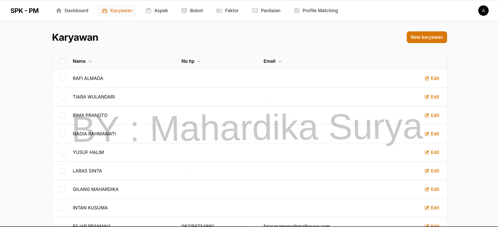
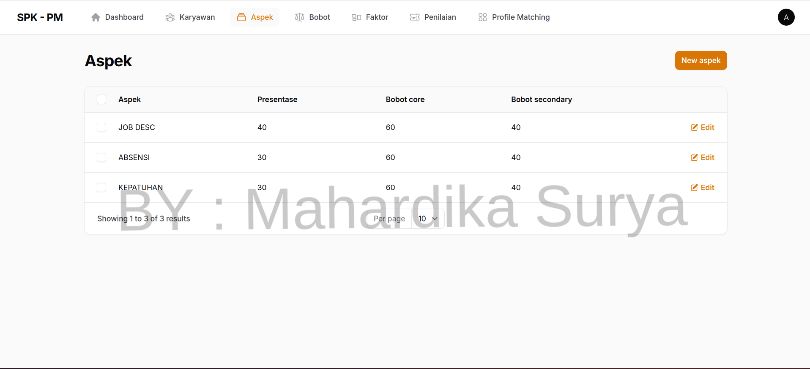
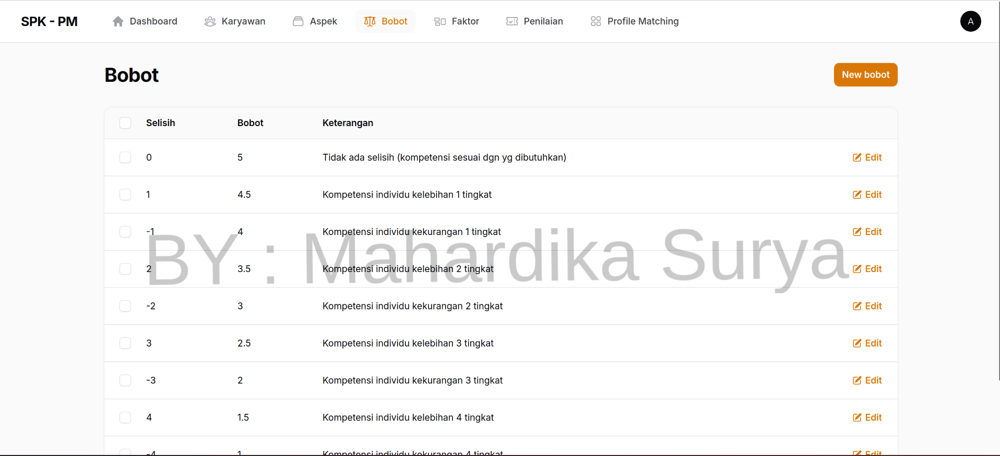
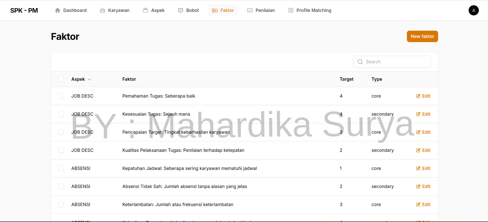
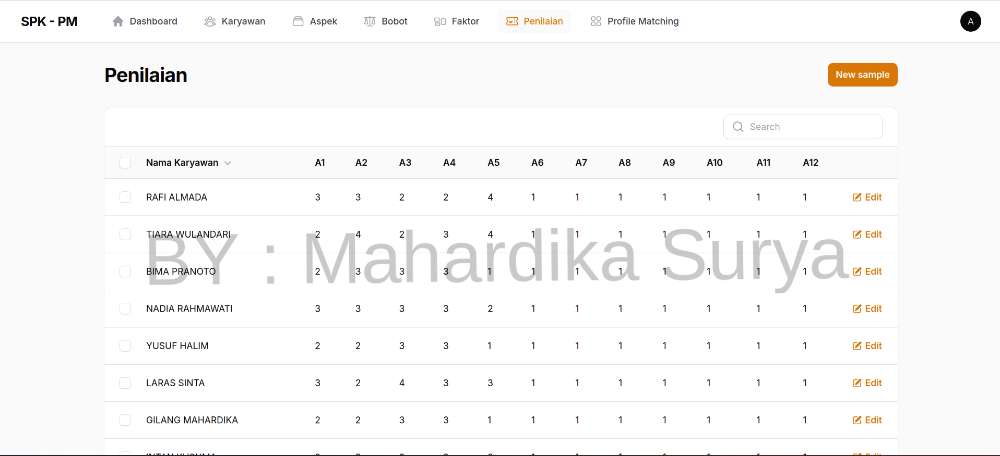
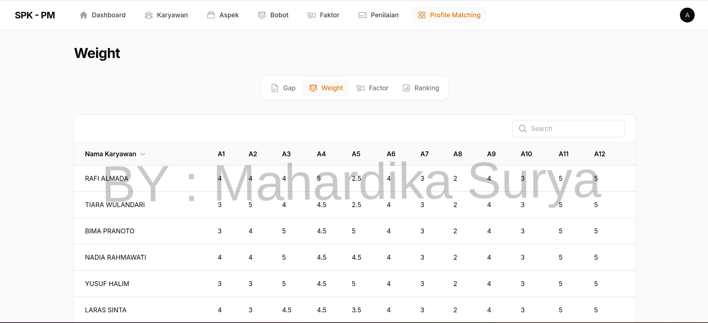
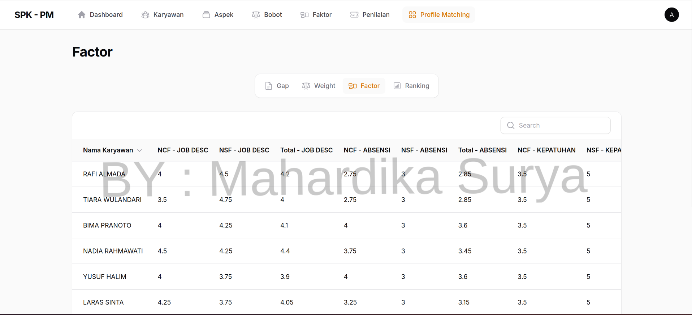
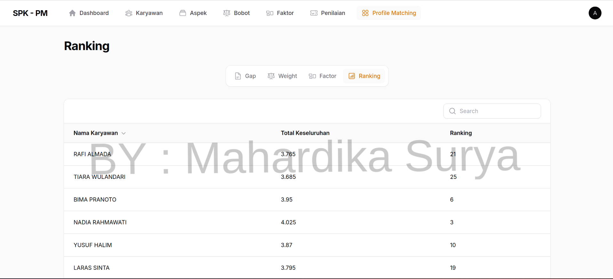

# 🎯 Decision Support System - Profile Matching (Preview)

This application is a **Decision Support System (DSS)** built with **Laravel**, using the **Profile Matching** method to assist in making accurate and objective decisions during a selection process based on predefined criteria.

## 👤 Candidates Being Evaluated

These are individuals or entities subject to evaluation. Examples include:
- Job applicants
- Outstanding students
- Scholarship recipients

Each candidate is scored based on several criteria and compared against an **ideal profile**.

## 🧩 Aspects

Aspects are the major categories used for evaluation. Examples:
- Core Competency
- Work Attitude
- Technical Knowledge

Each aspect carries a weight and consists of multiple **factors**.

### ⚖️ Weights

Once the GAP (difference between the candidate's actual score and the ideal score) is calculated, it is converted into a preference weight based on the following scale.

### ⚙️ Factors

Factors are indicators or sub-criteria under each aspect, such as:
- Discipline
- Teamwork
- Technical Understanding

Factors are divided into two types:
- Core Factor (CF)
- Secondary Factor (SF)

Each factor also has a specific weight.

## 📝 Scoring

Candidates are rated on a scale (e.g., 1–5) for each factor based on performance or qualification levels.

## 🔄 Profile Matching Process

The **Profile Matching** process involves matching a candidate’s profile to an ideal profile through several stages:

### 1️⃣ GAP Calculation

Calculating the **difference (gap)** between the candidate’s actual score and the ideal score for each factor:

### 2️⃣ GAP Weighting

Each GAP value is converted to a weight using a predefined conversion table.

### 3️⃣ Factor Score Calculation

Average weighted scores are calculated separately for:
- Core Factor (CF)
- Secondary Factor (SF)

### 4️⃣ Ranking

The final score for each candidate is computed by summing up scores from all aspects. Candidates are then **ranked from highest to lowest** based on their total score.

---

## 🛠️ Technologies Used

- Laravel 12.x
- TALL Stack

---

## 📬 Contact

For the **completed version** of this application or for further inquiries, feel free to contact me at:

**📧 hallodiik@gmail.com**

